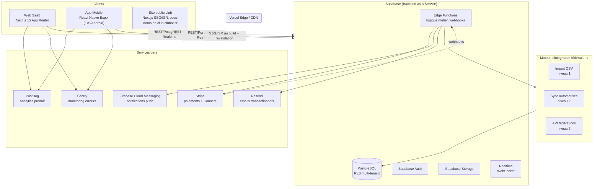

# ClubOS — Architecture technique

*Sections 4 à 7 et 10 du cahier des charges : architecture globale, backend, frontend, mobile, diagrammes.*

---

## 4. Architecture globale



**Principes directeurs :**

- **Un seul backend logique** (Supabase) partagé par les trois surfaces produit, exposant PostgREST (CRUD standard filtré par RLS) et des Edge Functions pour la logique métier qui ne peut pas être exprimée en RLS/SQL pur (calculs, appels tiers, orchestration).
- **La base de données est la frontière de sécurité principale** via Row Level Security (RLS) — voir `03-DONNEES.md` §Multi-tenant. Le rôle et le tenant de l'utilisateur sont portés dans le JWT Supabase Auth (custom claims), lus par les policies RLS à chaque requête.
- **Hébergement Vercel** pour le web et le site public (edge network, ISR pour les sites publics des clubs), **Supabase Cloud** pour le backend, **EAS (Expo Application Services)** pour le build et la distribution mobile.
- **Observabilité dès le MVP** : Sentry sur web + mobile, PostHog pour le comportement produit (funnels d'onboarding, usage des convocations), logs structurés des Edge Functions.

---

## 5. Architecture backend

### Composants

| Composant | Rôle |
|---|---|
| **PostgreSQL (Supabase)** | Source de vérité unique, schéma multi-tenant avec RLS (voir `03-DONNEES.md`) |
| **Supabase Auth** | Authentification email/mot de passe + lien magique + OAuth (Google/Apple pour mobile) ; JWT enrichi de `tenant_id` et `role` via un hook `custom_access_token` |
| **Supabase Storage** | Documents (certificats médicaux, pièces jointes), photos (joueurs, actualités, boutique), buckets séparés par tenant avec policies RLS sur `storage.objects` |
| **Edge Functions (Deno)** | Logique métier serveur : création de convocation avec sélection assistée par IA, webhooks Stripe, envoi de notifications push/email, jobs de synchronisation fédération, génération/révalidation du site public |
| **Realtime** | Souscriptions sur `convocations`, `presences`, `messages` pour mise à jour live (ex. un dirigeant voit les réponses aux convocations arriver en direct) |
| **pg_cron (Supabase)** | Tâches planifiées : relances automatiques de convocations sans réponse, alertes d'expiration de certificat médical, jobs de sync fédération niveau 2 |

### Logique métier clé côté serveur (Edge Functions)

- `convocation-create` : crée une convocation, calcule la liste suggérée par l'assistant IA (présences récentes + disponibilités déclarées), déclenche les notifications.
- `convocation-remind` : job planifié, relance les licenciés sans réponse à J-2 et J-1 de l'événement.
- `stripe-webhook` : traite `checkout.session.completed`, `invoice.paid`, `payment_intent.payment_failed` ; met à jour `paiements` et déclenche les reçus par email.
- `federation-sync` : orchestre les connecteurs niveau 2/3 (voir `03-DONNEES.md` §Connecteurs), réconcilie les licenciés importés avec les comptes existants.
- `public-site-revalidate` : déclenché par trigger DB (webhook Postgres → Edge Function) quand une actualité, un résultat ou une équipe change, pour revalider l'ISR du site public concerné.
- `ai-assist` : point d'entrée unique vers le fournisseur LLM pour les fonctionnalités IA (rédaction d'actu, résumé de match, suggestion d'effectif), avec garde-fous de prompt et limitation par plan tarifaire.

### Multi-tenant au niveau backend

Chaque requête est scoping automatiquement par `tenant_id` (club) via RLS. Les rôles de supervision (comité, ligue, fédération) obtiennent un accès **en lecture agrégée** via des vues Postgres dédiées (`vw_comite_dashboard`, `vw_ligue_dashboard`) qui joignent les tenants rattachés sans exposer d'accès en écriture croisé — détail dans `03-DONNEES.md` §Schéma multi-tenant.

---

## 6. Architecture frontend (Web)

### Stack

- **Next.js 15** (App Router, Server Components par défaut, Server Actions pour les mutations simples)
- **TypeScript strict**
- **Tailwind CSS v4** + **Shadcn UI** (composants copiés dans `packages/ui`, pas de dépendance runtime externe)
- **Supabase SSR** (`@supabase/ssr`) pour la session côté serveur et côté client
- **Zod** pour la validation des formulaires et des payloads d'API

### Organisation (feature-based)

```
apps/web/src/
  app/
    (public)/                    # site marketing ClubOS (pas le site des clubs)
    (auth)/
      login/  signup/  join/[code]/
    (app)/
      [clubSlug]/
        dashboard/
        adherents/
        equipes/
        calendrier/
        convocations/
        presences/
        communication/
        paiements/
        boutique/
        partenaires/
        documents/
        parametres/
    (comite)/[comiteSlug]/...
    (ligue)/[ligueSlug]/...
    api/                          # route handlers (webhooks, endpoints non couverts par PostgREST)
  components/                     # composants spécifiques à l'app web
  features/                       # logique métier par domaine (convocations/, paiements/, ...)
  lib/                            # clients Supabase, Stripe, utils
```

### Routage multi-tenant

- **Espace de gestion** : `app.clubos.fr/[clubSlug]/...` (ou domaine dédié du club en V2, ex. `club-hbc-lesneven.fr/admin`).
- **Site public généré** : `[clubSlug].clubos.fr` ou domaine personnalisé du club, résolu par middleware Next.js (lecture du header `Host`, lookup du tenant, réécriture vers `app/(public-club)/[clubSlug]`).
- Le rôle de l'utilisateur (joueur/parent/entraîneur/dirigeant/admin club/comité/ligue) détermine la navigation affichée, calculée côté serveur à partir du JWT.

### Rendu du site public club

Généré en **ISR (Incremental Static Regeneration)** : pages statiques par défaut, revalidées à la demande (webhook DB → Edge Function → `revalidatePath`) quand une actualité, un résultat ou une équipe change côté SaaS. Zéro action manuelle du club.

---

## 7. Architecture mobile

### Stack

- **React Native (Expo, managed workflow)** + **TypeScript**
- **Expo Router** (navigation file-based, cohérente avec App Router côté web)
- **Expo Notifications + Firebase Cloud Messaging** pour le push natif
- Client **Supabase JS** partagé avec le web via `packages/database` (types) et un package `packages/api-client` commun

### Organisation

```
apps/mobile/
  app/
    (auth)/login.tsx  signup.tsx  join.tsx
    (tabs)/
      index.tsx            # Accueil / actualités du club
      calendrier.tsx
      convocations.tsx
      presences.tsx         # visible entraîneur uniquement
      profil.tsx
    convocation/[id].tsx
    covoiturage/[eventId].tsx
    _layout.tsx
  components/
  features/
  lib/
    supabase.ts
    notifications.ts
    offline-cache.ts
```

### Navigation par rôle

La navigation par onglets (`(tabs)`) est **recomposée dynamiquement selon le rôle** de l'utilisateur connecté (voir `04-PRODUIT.md` §Arborescence mobile) :

- **Joueur/Parent** : Accueil, Calendrier, Convocations, Profil.
- **Entraîneur** : + Présences, + gestion d'effectif.
- **Dirigeant/Admin club** : accès à une vue simplifiée du back-office (pas de gestion complète sur mobile en V1, renvoi vers le web pour les tâches avancées).

### Offline et performance

- **Cache local (MMKV ou SQLite Expo)** pour convocations et calendrier des 30 prochains jours — consultables hors ligne.
- **Réponse à une convocation depuis la notification push** (deep link + action rapide), sans ouvrir l'app si possible (quick actions iOS/Android).
- **EAS Build + EAS Update** pour les mises à jour OTA du JS sans repasser par les stores à chaque correctif mineur.

---

*Suite : [`03-DONNEES.md`](03-DONNEES.md) — schéma PostgreSQL complet, multi-tenant, connecteurs fédérations.*
