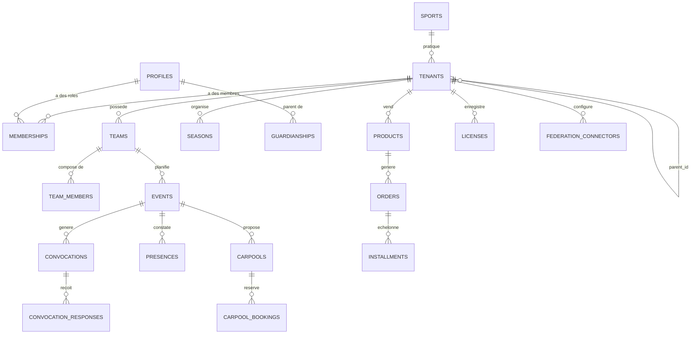

# ClubOS — Modèle de données

*Sections 8 et 9 du cahier des charges : schéma PostgreSQL complet, schéma multi-tenant.*
*Implémentation exécutable : [`packages/database/prisma/schema.prisma`](../packages/database/prisma/schema.prisma) et [`packages/database/sql/001_init.sql`](../packages/database/sql/001_init.sql) (RLS).*

---

## 8-9. Principe multi-tenant

Plutôt que des tables séparées `clubs`, `comites`, `ligues`, `federations` (qui obligeraient à dupliquer toute la logique de permissions à chaque niveau), ClubOS utilise une **table unique `tenants`** auto-référencée :

```sql
create type tenant_type as enum ('federation', 'league', 'committee', 'club');

create table tenants (
  id            uuid primary key default gen_random_uuid(),
  parent_id     uuid references tenants(id),
  type          tenant_type not null,
  sport_id      uuid references sports(id),        -- null si multi-sport (comité/ligue omnisports)
  name          text not null,
  slug          text not null unique,
  subdomain     text unique,                        -- ex. hbclesneven -> hbclesneven.clubos.fr
  custom_domain text unique,                         -- ex. club-hbc-lesneven.fr
  path          ltree not null,                      -- chemin matérialisé pour requêtes de hiérarchie rapides
  logo_url      text,
  address       jsonb,
  siret         text,
  settings      jsonb not null default '{}',
  created_at    timestamptz not null default now()
);

create index tenants_path_gist_idx on tenants using gist (path);
create index tenants_parent_idx on tenants (parent_id);
```

L'extension **`ltree`** de PostgreSQL matérialise le chemin hiérarchique (`federation_id.league_id.committee_id.club_id`) pour des requêtes de supervision efficaces (`path <@ 'ffhb.bretagne.finistere'` retourne tous les descendants) sans CTE récursive à chaque appel. `path` est recalculé par trigger à l'insertion/déplacement d'un tenant.

Cette conception permet d'ajouter un niveau (ex. une zone géographique intermédiaire) ou un nouveau sport **sans migration de schéma** — seulement de nouvelles lignes dans `tenants` et `sports`.

### Rattachement utilisateur ↔ tenant : `memberships`

```sql
create type member_role as enum (
  'player', 'parent', 'coach', 'director',
  'club_admin', 'committee_admin', 'league_admin', 'federation_admin'
);

create table memberships (
  id          uuid primary key default gen_random_uuid(),
  tenant_id   uuid not null references tenants(id) on delete cascade,
  user_id     uuid not null references auth.users(id) on delete cascade,
  role        member_role not null,
  status      text not null default 'active',   -- active | pending | archived
  joined_at   timestamptz not null default now(),
  unique (tenant_id, user_id, role)
);
```

Un utilisateur peut avoir plusieurs `memberships` (ex. parent dans un club + entraîneur bénévole dans le même club ; ou dirigeant de club **et** élu de comité — deux memberships sur deux tenants différents). Les rôles `*_admin` sur un tenant de type `committee`/`league`/`federation` donnent un accès **lecture agrégée** sur les tenants descendants (via `path`), jamais d'écriture croisée sur les données opérationnelles d'un club — voir §RLS ci-dessous et `05-API-PERMISSIONS.md`.

### RLS (Row Level Security) — principe général

Le JWT Supabase Auth est enrichi via un hook `custom_access_token` qui y ajoute `tenant_ids` (liste des tenants où l'utilisateur a un membership actif) — évite un aller-retour DB à chaque requête pour le cas courant.

```sql
alter table events enable row level security;

create policy "tenant members can read events"
on events for select
using (
  tenant_id = any (auth.jwt_tenant_ids())
  or exists (
    select 1 from tenants t
    where t.id = events.tenant_id
      and t.path <@ (select path from tenants where id = any (auth.jwt_supervisor_tenant_ids()))
  )
);

create policy "coaches and admins can write events"
on events for insert with check (
  exists (
    select 1 from memberships m
    where m.tenant_id = events.tenant_id
      and m.user_id = auth.uid()
      and m.role in ('coach', 'director', 'club_admin')
  )
);
```

Le détail complet des policies par table est dans `sql/001_init.sql`. Principe constant : **lecture** ouverte aux membres du tenant + superviseurs hiérarchiques (via `ltree`), **écriture** restreinte par rôle métier (cf. matrice complète `05-API-PERMISSIONS.md` §19).

---

## Catalogue complet des tables

| Domaine | Tables | Rôle |
|---|---|---|
| **Organisation** | `sports`, `tenants`, `seasons` | Référentiel sports, hiérarchie tenants, saisons sportives |
| **Identité** | `profiles`, `memberships`, `guardianships` | Profils utilisateurs (extension de `auth.users`), rattachements tenant/rôle, lien parent ↔ enfant |
| **Licences fédérales** | `licenses`, `federation_connectors`, `federation_sync_logs` | Données de licence importées/synchronisées, configuration et logs des connecteurs |
| **Équipes** | `teams`, `team_members` | Catégories/équipes d'un club, effectifs et encadrement |
| **Calendrier** | `events` | Matchs, entraînements, événements de club |
| **Convocations** | `convocations`, `convocation_responses` | Sélection pour un événement, réponses des convoqués |
| **Présences** | `presences` | Émargement réel (entraînements et matchs) |
| **Covoiturage** | `carpools`, `carpool_bookings` | Trajets proposés et réservations |
| **Communication** | `posts`, `chat_messages`, `notifications` | Actualités club/équipe, chat d'équipe, notifications multi-canal |
| **Documents** | `documents` | Certificats médicaux, règlements, pièces partagées, avec expiration |
| **Paiements** | `products`, `orders`, `installments` | Cotisations, boutique, billetterie ; échéanciers ; intégration Stripe |
| **Partenaires** | `sponsors` | Sponsors et visibilité (site public + app) |
| **Bénévolat** (premium) | `volunteer_missions`, `volunteer_assignments` | Missions bénévoles, affectations, heures |
| **Site public** | `site_pages`, `site_settings` | Contenu et configuration du site public généré par club |
| **Conformité RGPD** | `consents`, `data_requests`, `audit_logs` | Consentements, demandes d'export/suppression, journalisation |

Schéma complet exécutable (colonnes, contraintes, index, RLS) : voir `packages/database/prisma/schema.prisma` (source de vérité pour le typage applicatif) et `packages/database/sql/001_init.sql` (source de vérité pour les policies RLS, non exprimables en Prisma).

---

## Diagramme entité-relation simplifié (cœur du produit)



---

## Moteur d'intégration fédérations

Trois niveaux, activables indépendamment par club/tenant, sans changement de code pour ajouter une fédération :

| Niveau | Mécanisme | Exemple |
|---|---|---|
| **1 — Import CSV** | Upload manuel d'un export fédération, mapping de colonnes configurable en JSON par `federation_code`, création/mise à jour des `licenses` + `profiles` | Export Gest'Hand licenciés → mapping `licence_number`, `nom`, `prenom`, `categorie`, `date_certif` |
| **2 — Synchronisation automatisée** | Job planifié (`pg_cron` + Edge Function) qui scrape/appelle un export périodique si la fédération le permet (ex. lien d'export récurrent), réconciliation automatique par numéro de licence | Sync hebdomadaire Gest'Hand |
| **3 — API fédération** | Connecteur dédié par fédération (`packages/connectors/<federation_code>`), implémentant une interface commune `FederationConnector` (`fetchLicenses()`, `fetchResults()`, `fetchFixtures()`) | API FFF, API FFBB si/quand ouvertes |

```ts
// packages/connectors/src/types.ts
export interface FederationConnector {
  code: string; // 'ffhb' | 'fff' | 'ffbb' | 'fftennis' | ...
  level: 1 | 2 | 3;
  fetchLicenses(tenantId: string): Promise<LicenseImportRow[]>;
  fetchResults?(tenantId: string): Promise<ResultImportRow[]>;
  fetchFixtures?(tenantId: string): Promise<FixtureImportRow[]>;
}
```

Ajouter une fédération = implémenter cette interface dans un nouveau module `packages/connectors/src/<code>.ts` et l'enregistrer dans un registre (`connectors/src/registry.ts`) — **zéro modification du cœur applicatif ou du schéma de données.**

---

*Suite : [`04-PRODUIT.md`](04-PRODUIT.md) — user stories, wireframes textuels, arborescences des applications.*
