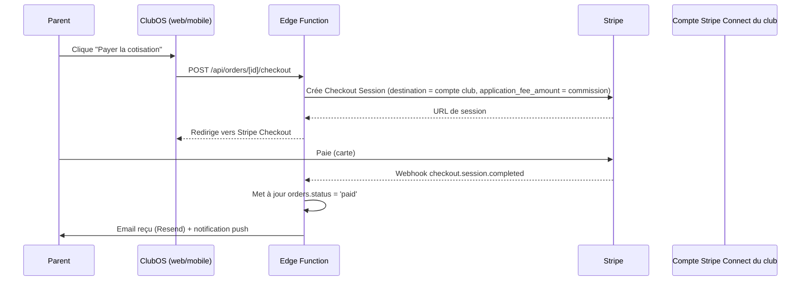

# ClubOS — Paiements et notifications

*Sections 20 et 21 du cahier des charges.*

---

## 20. Schéma Stripe

### Modèle retenu : Stripe Connect (Standard)

Chaque club est un **compte connecté** Stripe (Connect Standard), ClubOS agissant comme plateforme. Cela permet :

- aux cotisations/boutique/billetterie d'un club d'être versées directement sur son propre compte bancaire (pas d'argent qui transite par ClubOS au-delà de la commission) ;
- une conformité simplifiée (KYC porté par Stripe, pas par ClubOS) ;
- une commission plateforme prélevée automatiquement via `application_fee_amount` sur chaque paiement.



### Entités

| Entité Stripe | Entité ClubOS | Lien |
|---|---|---|
| Compte connecté (`acct_...`) | `tenants.stripe_account_id` | 1 club = 1 compte Connect |
| Checkout Session | `orders.stripe_checkout_session_id` | Créée à l'initiation du paiement |
| Payment Intent | `orders.stripe_payment_intent_id` | Confirmé au succès |
| Invoice / Subscription (échéancier) | `installments` (table ClubOS, pas de subscription Stripe native — échéancier géré côté ClubOS avec relances programmées, paiement carte à chaque échéance) | 1 order → N installments |
| Payout | (géré par Stripe directement vers le compte club, non modélisé côté ClubOS) | — |

### Cas d'usage couverts

- **Cotisation en un paiement** : Checkout Session simple.
- **Cotisation échelonnée** : `order` avec plusieurs `installments`, chaque échéance déclenche une nouvelle Checkout Session à sa date (via pg_cron + email de rappel Resend + notification push).
- **Boutique** : panier multi-articles → une Checkout Session avec `line_items` détaillés.
- **Billetterie (premium)** : Checkout Session avec quantité de billets, génération d'un QR code par billet (stocké dans `documents`).
- **Remboursement** : déclenché depuis l'interface dirigeant → `stripe.refunds.create`, met à jour `orders.status = 'refunded'`.

### Webhooks traités (`/api/webhooks/stripe`)

`checkout.session.completed` · `payment_intent.payment_failed` · `charge.refunded` · `account.updated` (suivi de l'onboarding Connect du club).

---

## 21. Schéma notifications

### Table `notifications`

```sql
create type notification_channel as enum ('push', 'email', 'sms');

create table notifications (
  id          uuid primary key default gen_random_uuid(),
  user_id     uuid not null references auth.users(id),
  tenant_id   uuid references tenants(id),
  type        text not null,             -- 'convocation_new' | 'convocation_reminder' | 'payment_due' | 'document_expiring' | 'post_published' | 'carpool_booked' | ...
  title       text not null,
  body        text not null,
  deep_link   text,                       -- ex. 'clubos://convocation/abc123'
  channel     notification_channel not null,
  read_at     timestamptz,
  sent_at     timestamptz,
  created_at  timestamptz not null default now()
);
```

### Matrice événement → canal(x)

| Événement | Push | Email | SMS (futur) | Déclencheur |
|---|---|---|---|---|
| Nouvelle convocation | ✔ | — | — | `convocation-create` |
| Relance convocation sans réponse (J-2, J-1) | ✔ | — | Optionnel Premium | `convocation-remind` (pg_cron) |
| Confirmation de paiement | ✔ | ✔ (reçu) | — | webhook Stripe |
| Échéance de paiement à venir | ✔ | ✔ | — | pg_cron, 3 jours avant échéance |
| Certificat médical expirant sous 30/15/7 jours | ✔ | ✔ | — | pg_cron quotidien |
| Nouvelle actualité club/équipe | ✔ | — | — | publication `posts` |
| Place de covoiturage réservée/annulée | ✔ | — | — | `carpool_bookings` insert/delete |
| Communication descendante comité/ligue | ✔ | ✔ | — | publication `posts` (scope supervision) |
| Invitation à rejoindre un club | — | ✔ | — | création code d'invitation |

### Architecture d'envoi

- **Push** : Edge Function → Firebase Cloud Messaging (tokens stockés dans `push_tokens`, un par device, rattaché à `user_id`).
- **Email** : Edge Function → Resend, templates React Email versionnés dans `packages/emails`.
- **SMS** : hors MVP, prévu en add-on premium (§ Modules Premium), fournisseur à sélectionner (Twilio ou Vonage) au moment de l'implémentation.

### Préférences utilisateur

Table `notification_preferences` (`user_id`, `type`, `channel`, `enabled`) — un utilisateur peut désactiver un type de notification par canal (ex. garder le push mais couper l'email pour les actualités), avec des minimums non désactivables pour les convocations (sécurité fonctionnelle : on ne permet pas de couper totalement les notifications de convocation, seulement de changer le canal).

---

*Suite : [`07-CONFORMITE-DEVOPS.md`](07-CONFORMITE-DEVOPS.md) — plan RGPD, plan DevOps.*
