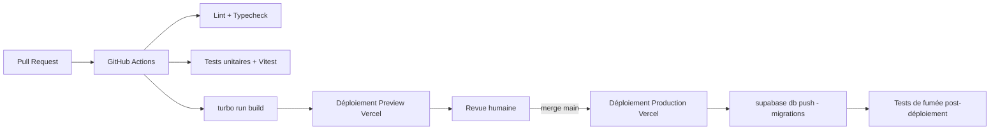

# ClubOS — Conformité RGPD et DevOps

*Sections 22 et 23 du cahier des charges.*

---

## 22. Plan RGPD

### Principes

- **Minimisation** : seules les données nécessaires à l'usage (identité, contact, données sportives) sont collectées. Pas de champ libre non justifié.
- **Finalité explicite** par catégorie de donnée (gestion sportive, communication, paiement, santé pour le certificat médical — catégorie sensible, accès restreint).
- **Base légale** : exécution du contrat (adhésion au club) pour l'essentiel, consentement explicite pour les communications marketing (add-ons, newsletters ClubOS elle-même) et pour la géolocalisation covoiturage.

### Consentements (`consents`)

```sql
create table consents (
  id            uuid primary key default gen_random_uuid(),
  user_id       uuid not null references auth.users(id),
  consent_type  text not null,   -- 'data_processing' | 'marketing_emails' | 'push_notifications' | 'carpool_location'
  granted       boolean not null,
  granted_at    timestamptz,
  revoked_at    timestamptz
);
```

Recueilli à l'onboarding (obligatoires : traitement des données pour l'usage club) et dans les paramètres du compte (révocables à tout moment pour les consentements optionnels).

### Droit d'accès, de rectification, de portabilité, d'effacement (`data_requests`)

```sql
create type data_request_type as enum ('export', 'deletion', 'rectification');
create type data_request_status as enum ('pending', 'processing', 'completed', 'rejected');

create table data_requests (
  id          uuid primary key default gen_random_uuid(),
  user_id     uuid not null references auth.users(id),
  type        data_request_type not null,
  status      data_request_status not null default 'pending',
  requested_at timestamptz not null default now(),
  completed_at timestamptz,
  export_url  text            -- lien signé Supabase Storage, expirant, pour un export
);
```

- **Export** : Edge Function planifiée génère un JSON/CSV de toutes les données rattachées à l'utilisateur (profil, memberships, convocations, présences, commandes), déposé dans un bucket privé avec URL signée à expiration courte (72h).
- **Suppression** : anonymisation des données historiques nécessaires à l'intégrité du club (ex. une présence reste comptée statistiquement mais l'identité est détachée) plutôt que suppression physique en cascade destructrice — sauf demande explicite de suppression totale, traitée manuellement par le support avec confirmation double.
- **Délai réglementaire** : traitement sous 30 jours, statut visible par l'utilisateur dans ses paramètres de compte.

### Journalisation (`audit_logs`)

```sql
create table audit_logs (
  id          uuid primary key default gen_random_uuid(),
  tenant_id   uuid references tenants(id),
  actor_id    uuid references auth.users(id),
  action      text not null,        -- 'member.role_changed' | 'document.deleted' | 'export.requested' | ...
  target_table text,
  target_id   uuid,
  metadata    jsonb,
  created_at  timestamptz not null default now()
);
```

Toute action sensible (changement de rôle, suppression de document, export/suppression de données, changement de configuration paiement) est journalisée avec acteur, cible et horodatage — consultable par l'admin club et exportable en cas de contrôle CNIL.

### Séparation stricte des données

- **RLS multi-tenant** (cf. `03-DONNEES.md`) empêche structurellement l'accès croisé entre clubs.
- **Chiffrement au repos** (géré par Supabase/Postgres) et **en transit** (TLS obligatoire partout).
- **Champs sensibles** (certificats médicaux) : bucket Storage dédié avec policy RLS stricte (accès : le licencié concerné, ses parents, les dirigeants du club — jamais les autres licenciés ni les niveaux de supervision).
- **Sous-traitants** (Supabase, Vercel, Stripe, Firebase, Resend, PostHog, Sentry) listés dans un registre de sous-traitance publié, avec localisation des données vérifiée (priorité UE pour les hébergeurs le permettant).

### RBAC exposition IA

Les fonctionnalités IA (§ Modules Premium) n'envoient au fournisseur LLM que les données strictement nécessaires au prompt (ex. historique de présence anonymisé par identifiant interne, pas de données de contact) — détaillé dans la politique de traitement IA à rédiger avant activation du module.

---

## 23. Plan DevOps

### Environnements

| Environnement | Web | Backend | Usage |
|---|---|---|---|
| **Local** | `next dev` | Supabase local (`supabase start`, Docker) | Développement |
| **Preview** | Vercel Preview Deployments (par PR) | Projet Supabase de staging partagé | Revue de PR |
| **Staging** | Vercel (branche `staging`) | Projet Supabase dédié staging | Recette avant release |
| **Production** | Vercel (branche `main`) | Projet Supabase production | Utilisateurs réels |

### CI/CD



- **GitHub Actions** : lint, typecheck (`tsc --noEmit`), tests (Vitest pour la logique métier, Playwright pour les parcours critiques web), build Turborepo avec cache distant.
- **Migrations de base de données** versionnées dans `packages/database/sql/` et `supabase/migrations/`, appliquées via `supabase db push` en pipeline, jamais manuellement en production.
- **Mobile** : EAS Build déclenché manuellement pour les releases stores, **EAS Update** pour les correctifs OTA du bundle JS entre deux releases stores.
- **Feature flags** : PostHog Feature Flags pour activer progressivement les modules premium par club (rollout contrôlé, kill switch rapide).

### Monitoring et alerting

- **Sentry** (web + mobile) : erreurs runtime, alertes Slack/email sur pics d'erreurs.
- **PostHog** : funnels d'onboarding club, taux de réponse aux convocations, rétention.
- **Supabase built-in** : métriques base de données (connexions, requêtes lentes), logs Edge Functions.
- **Uptime** : monitoring externe (ex. Better Uptime) sur les endpoints publics critiques (login, site public, webhook Stripe).

### Sauvegardes et continuité

- Sauvegardes automatiques quotidiennes Supabase (point-in-time recovery activé dès le plan payant).
- Export de secours mensuel automatisé vers un stockage froid séparé (S3-compatible), indépendant du fournisseur principal, pour couvrir un scénario de défaillance Supabase.

---

*Suite : [`08-ROADMAP-BACKLOG.md`](08-ROADMAP-BACKLOG.md) — roadmap MVP/V1/V2, backlog complet.*
